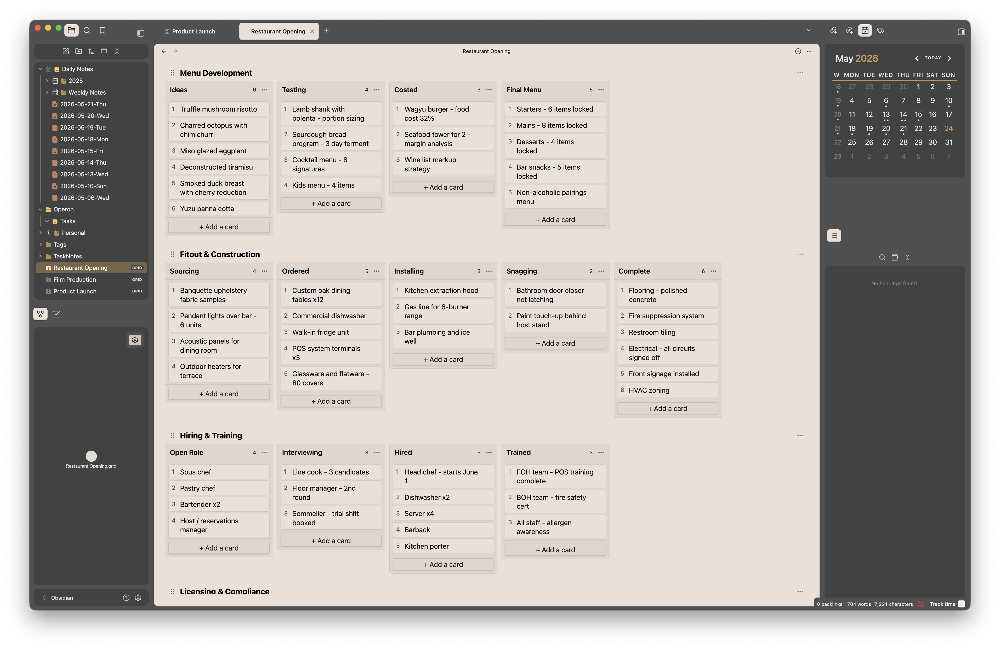

# Kanban Grid

An [Obsidian](https://obsidian.md) plugin for 2D kanban boards. Each board is a `.grid` file with multiple **rows** (swimlanes), each containing its own **columns** and **cards**.



## Features

- **Multiple boards** — each `.grid` file is an independent board
- **Independent rows** — every row has its own columns (e.g. one project uses "Backlog/Sprint/Done", another uses "Ideas/Testing/Live")
- **Inline editing** — click any title (row, column, or card) to rename it
- **Drag and drop** — reorder cards within and across lanes, reorder rows via grip handle
- **Numbered cards** — cards are auto-numbered per column
- **No build step** — single `main.js`, no dependencies

## Install

Copy the `kanban-grid` folder into your vault's `.obsidian/plugins/` directory and enable it in Settings > Community Plugins.

## Usage

- Click the grid icon in the ribbon (or use command palette) to create a new board
- Click row/column titles to rename inline
- Use the `...` menu on rows to add columns or delete rows
- Use the `+` icon in the view header to add rows
- Drag the grip handle to reorder rows
- Right-click cards for edit/delete

## File Format

`.grid` files are JSON:

```json
{
  "rows": [
    {
      "id": "...",
      "name": "Project Alpha",
      "columns": ["To Do", "In Progress", "Done"],
      "cards": {
        "To Do": [{ "id": "...", "title": "My task" }]
      }
    }
  ]
}
```
